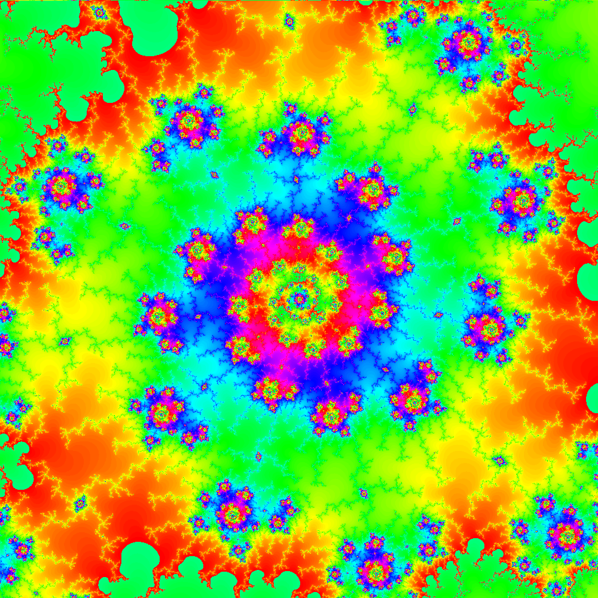
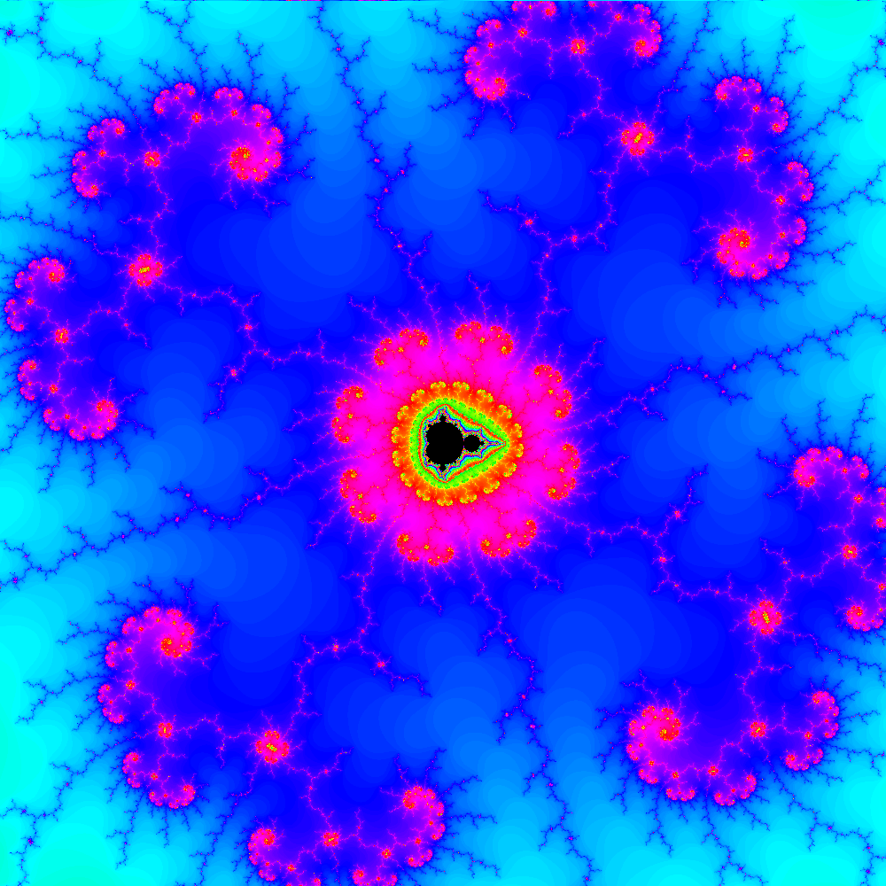

# mandelbrot-gif-generator
Creates a gif of Mandelbrot set being zoomed to a specific given point. _PIL_ and _opencv_ and _numpy_ libraries are needed.

## GUI Usage 

This app consists of the following parameters:

**X:** x coordinate of zooming point.
**Y:** y coordinate of zooming point.
**Initial zoom:** if value is 1, it shown the whole Mandelbrot set.
**N. frames:** Number of frames of gif file generated, zoom will be reduced by 0.1 per frame.
**Iterations:** Number of iterations to determine whether a point is in Mandelbrot set, the higher this value is, the more time the app will need to
generate the file.
**Size:** Size of the image (size x size px).

## How it works

A sixe x size pixels image is generated and divided into four quadrants. Four subprocesses will calculate if each point of its quadrant is in Mandelbrot set. The final result will be displayed on screen and saved as a gif file.

## Version

**Version 0.1:** Mandelbrot set is generated on a png image. There are some errors at the bottom of image.

**Version 0.2:** Input image no longer needed.

**Version 0.3:** Can create gif, zoom and coordinate bugs fixed.

**Version 0.35:** Gif creation improved, methods usage now is easier.

**Version 0.36:** Mandelbrot set generation fixed.

**Version 1.0:** GUI and EXE version added!

**Version 2.0:** Major changes. Library and GUI code merged, parallelized calculus, optimized performance.

## Bugs

- If you want to generate multiple images, restarting the app is highly recommended.
- If save image button is pressed and the window is closed, the app will stop working.
- Frame generation not working correctly.

## Example images

