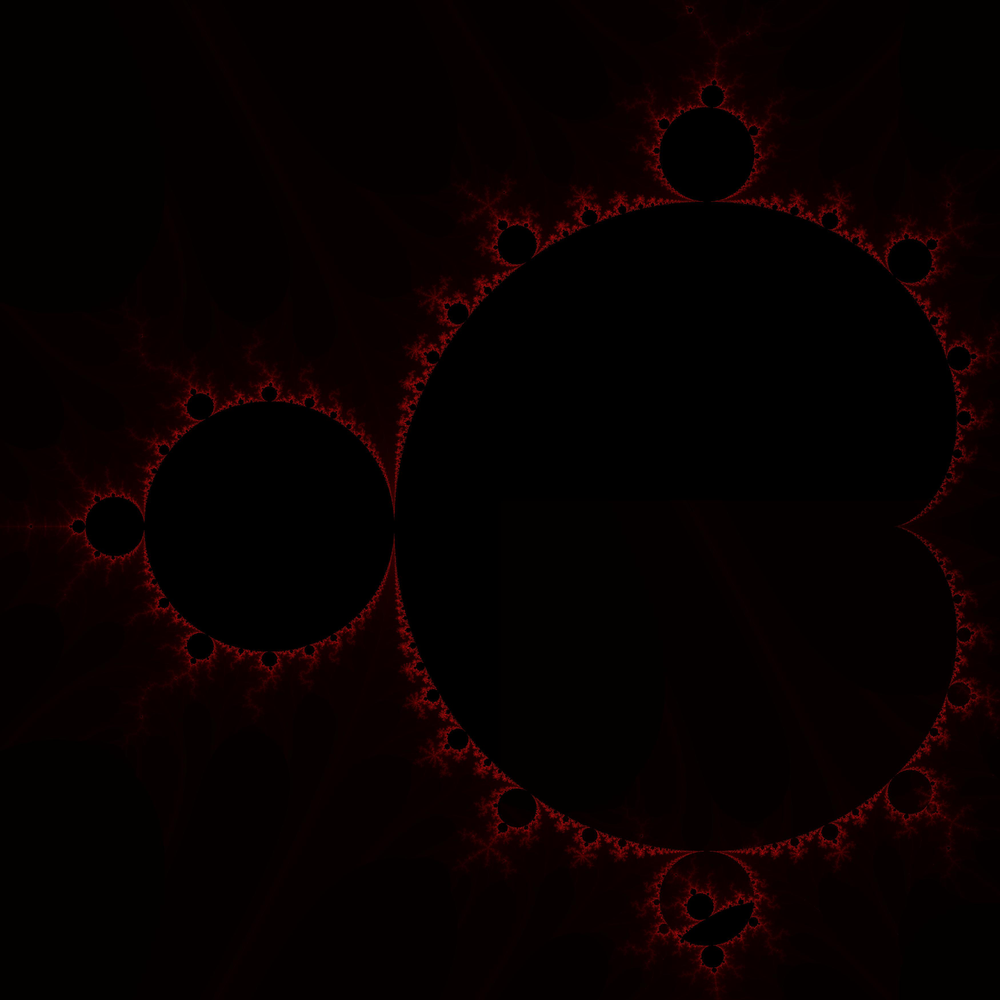

# mandelbrot-gif-generator
Creates a gif of Mandelbrot set being zoomed to a specific given point. _PIL_ and _ctypes_ libraries needed.

## Usage 

Select an image to edit and save Mandelbrot set, the size of the selected image will be the Mandelbrot set size.
To select the image, edit  _src_image_ and _dst_image_ variables with the path of the new image. 
To change the number of iterations, edit first argument of mandelbrot instance (700).

## How it works

As python libraries doesnt allow create a canvas and edit its pixels one by one, the program takes an image and edit each pixel based on scape time algorithm.
Afther generating the Mandelbrot set, the program saves it on the selected image.

## Version

**Version 0.1:** Mandelbrot set is generated on a png image. There are some errors at the bottom of image.

## Output

